<p align="center">
  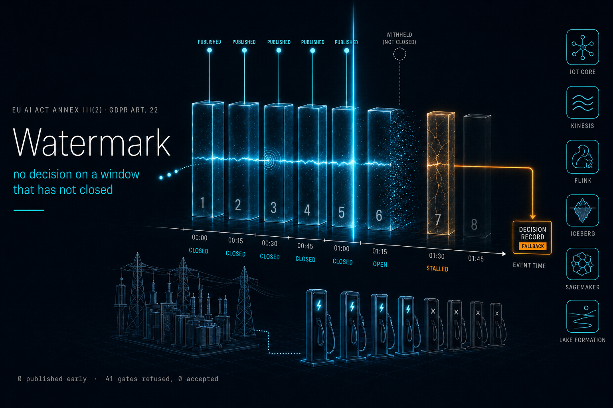
</p>

# Watermark

<p align="center">
  <a href="https://github.com/theofanis-tsakanikas/watermark/actions/workflows/ci.yml"></a>
  <a href="LICENSE"></a>
  
  
  <br>
  
  
  
  
  
  
  
  <br>
  
  
  
  
  
  
</p>

**A real-time decision platform for an electricity distribution network, where a decision
emitted from a window that has not closed is a build failure — and the safe state is a
conservative deterministic action, because on a grid, silence still overloads the transformer.**

*IoT Core · Kinesis · Managed Service for Apache Flink · Iceberg on S3 · SageMaker Feature Store · Lake Formation · Step Functions · Athena · dbt · Terraform*

> **Watermark** — the Flink term, and the thesis. A watermark is the system's claim about what it
> has seen. Every wrong decision in a streaming system is, underneath, a decision taken on data
> that had not arrived yet.

---

## The problem

A distribution system operator runs roughly 250,000 smart meters, 2,000 public EV chargers and
400 substations. Telemetry arrives continuously, out of order, sometimes twice, sometimes three
days late. Three decisions come out of that one stream, and they could not be more different:
throttle EV charging as a substation approaches its thermal limit, in **seconds**, with a physical
consequence; flag a meter for an inspector, in **hours**, with a significant effect on a person;
and publish hourly settled totals, over **days**, restated whenever late data arrives.

The interesting engineering is not in any one of them. It is that a single stream feeds all three,
and each is only correct under a different definition of *"we have seen enough"*. So the whole
system is built around one boundary: statistical models forecast, score and rank; **deterministic
code owns whether a window is closed, every published number, the decision to fall back, and
whether a decision may be actuated at all.** On the live estate, `3,779` rows were published and
`0` of them carried a watermark earlier than their own interval end.

---

## Status

Deployed to a real AWS account, driven, promoted from, served from, and torn down again — most
recently on **20 August 2026**. The five-step sequence ran in order, because a fresh account
cannot serve a model nobody has approved and so the endpoint cannot exist on the first deploy:

```
deploy (no endpoint) → capture → promote → deploy (endpoint) → capture
```

<p align="center">
  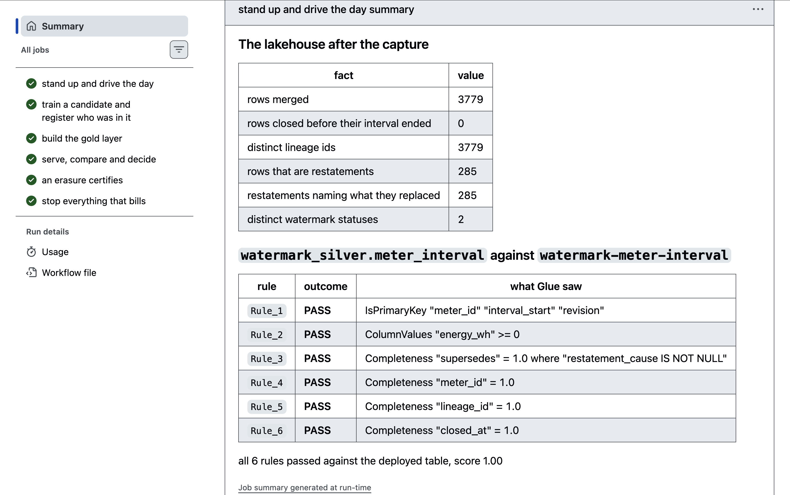<br>
  <sub><b>The whole thesis, as six numbers the estate produced</b> — <code>rows closed before their
  interval ended: <b>0</b></code> is claim 1 in SQL, checkable after the fact on every run.
  <code>distinct lineage ids</code> equals <code>rows merged</code>, so no two rows share an
  identity. <b>285</b> restatements, <b>285</b> of them naming what they replaced — doctrine 4, that
  a correction never erases. Below it, the Glue Data Quality ruleset against the deployed table:
  <b>6 of 6, score 1.00</b>, and <code>Rule_3</code> is doctrine 4 written as a rule that runs on
  real rows.</sub>
</p>

<p align="center">
  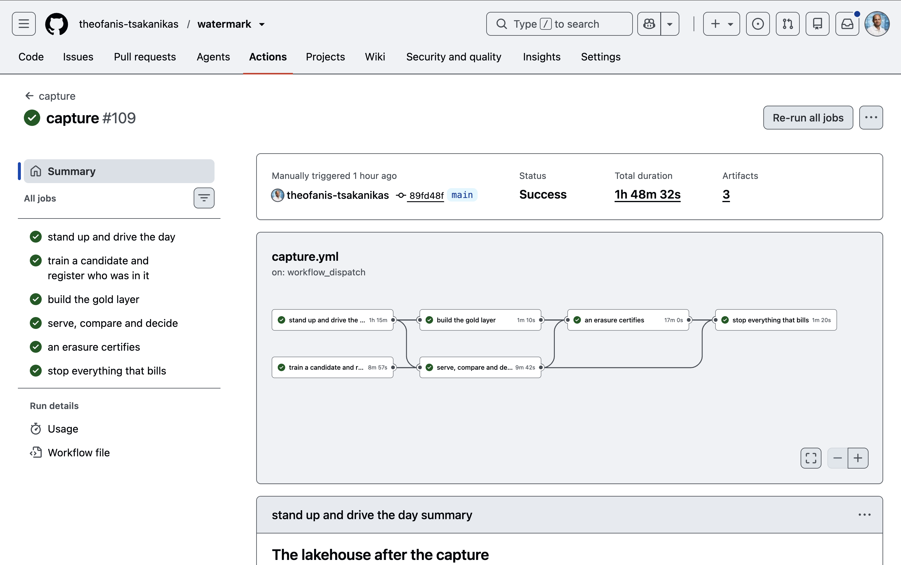<br>
  <sub><b>Six jobs, all green, 1h 48m 32s</b> — <i>stand up and drive the day</i> 1h 15m runs
  beside <i>train a candidate</i> 8m 57s; <i>build the gold layer</i> and <i>serve, compare and
  decide</i> fan out; <i>an erasure certifies</i> 17m waits for both, because it deletes rows the
  other two are reading; and <i>stop everything that bills</i> runs <code>if: always()</code>, so a
  capture that fails halfway still switches the three expensive things off. The commit is
  <code>89fd48f</code> — the same one the deploy applied.</sub>
</p>

What the estate asserted about itself on that run, each figure produced by a step that fails when
it is not true:

| asserted live, by the capture rather than read off a dashboard | result |
|---|---|
| rows published with a watermark earlier than their own interval end | **0** of 3,779 |
| the same day, delivered twice | **3,779 values identical** |
| the Glue Data Quality ruleset against the deployed table | **6 of 6 rules, score 1.00** |
| train/serve parity — three features, two mechanisms, no tolerance | **agreed, 0 diverged** |
| the silent substation held the watermark back, and named itself | **1 transition, 1 named**, of 3,646 reported |
| curtailment on a substation driven past its limit | **485,442 W of 450,000 W → 8 throttled**, every one marked as a fallback into the record |
| the live case matrix — every defect the synthetic cast declares | **7 of 7** |
| the erasure | **all 6 legs confirmed against the estate**, independently of the certificate |
| consequential decisions about a person | **20 pending, 0 actuated** — then exactly one, on a named human review |

**Nothing is standing now** — verified after the teardown, by asking the account rather than by
reading the workflow's exit code: 0 VPCs, 0 Kinesis streams, 0 Flink applications, 0 SageMaker
endpoints and feature groups, 0 state machines, 0 `watermark_*` databases, 0 IoT rules. The resting
state of this repository is the state bucket and its access-log bucket, the state KMS key, three
SSM parameters and a deploy role no human can assume. Everything below also runs with **no
AWS account at all**: 341 tests, nine claim harnesses and 40 planted gate violations, on a laptop,
in about four minutes.

---

## The seven claims

Every row is the output of one command in this repository. A row that is not here is work that has
not happened.

| | proved by | result |
|---|---|---|
| **1** · no decision comes out of a window that has not closed | `make claim-1` | **7/7** — a silent substation, a stalled stream, a device three hours fast, a partition down at start-up, and the healthy day that must *not* trip any of them |
| **2** · replay is identical | `make claim-2` | **5/5** — the same day shuffled under five seeds and delivered twice produces the same values, restatements and lineage ids |
| **3** · train/serve parity, between two genuinely different mechanisms | `make claim-3` | **5/5** — as-of SQL over Iceberg against a streaming materialiser, compared as integers, no tolerance |
| **4** · no decision on a stale feature | `make claim-4` | **7/7** — the gate is in front of the input, and the fallback marker survives into the record |
| **5** · no model reaches an endpoint without passing the gates | `make claim-5` | **12/12** — and the gate **refuses the model this repository trained**, for the finding in [BIAS-FINDING](docs/BIAS-FINDING.md) |
| **6** · erasure is complete to a declared boundary, and proved | `make claim-6` | **9/9** — no certificate unless every leg confirms, and the certificate names the leg deletion cannot reach |
| **7** · a consequential decision about a person cannot be actuated automatically | `make claim-7` | **8/8** — the contract does not load, and the actuation type cannot be constructed |

And the checks that make those claims mean something rather than merely pass:

| | result |
|---|---|
| `make gate-proof` | **40 refused, 0 accepted, 0 stale** |
| `make seed-check` | **4,312 deliveries** reproduce `recordings/day.json` exactly — 3,584 published, 283 restated, 284 quarantined |
| `make cases` | **11/11** offline · **7/7** against the deployed estate |
| `make policy` | **4 principals, 24 principal-resource pairs** — every reachable set exact and every closed path closed |
| `make test` | **341 passing**, offline, credential-free, no JVM, in three seconds |
| `terraform validate` · `checkov` | **6/6 layers** against real provider schemas · **0 findings**, with **64** deliberate exceptions each carrying a written reason beside the resource |
| `check_waivers` | **2 live, none expired** — doctrine 6, enforced by a clock rather than by a habit |

---

## Contents

| | |
|---|---|
| [The problem](#the-problem) · [Status](#status) | what breaks on a grid, and what actually ran |
| [The seven claims](#the-seven-claims) | one command per row |
| [Architecture](#architecture) | one stream, three horizons, and where a model may not decide |
| [No decision on a window that has not closed](#no-decision-on-a-window-that-has-not-closed) | claim 1, in SQL and in the job's own account of itself |
| [The same day, delivered twice](#the-same-day-delivered-twice) | claim 2, as two waves and as 3,779 identical values |
| [Two mechanisms, one contract](#two-mechanisms-one-contract) | claim 3, and why one function compared with itself is a tautology |
| [A model reaches traffic only through a person](#a-model-reaches-traffic-only-through-a-person) | claims 5 and 7, and the bias finding that refuses this repository's own model |
| [Erasure, and the leg it cannot reach](#erasure-and-the-leg-it-cannot-reach) | claim 6, six legs checked against the estate |
| [Nobody can read the lakehouse](#nobody-can-read-the-lakehouse) | Lake Formation and OIDC, demonstrated by being refused |
| [The gates are attacked](#the-gates-are-attacked) | 40 planted violations, each refused by name |
| [Quickstart](#quickstart) · [Testing](#testing) · [Repository layout](#repository-layout) | |
| [What this does not do](#what-this-does-not-do) · [Cost](#cost) · [Decisions](#decisions) | |
| [Docs](#docs) · [Security](#security) · [License](#license) | |

---

## Architecture

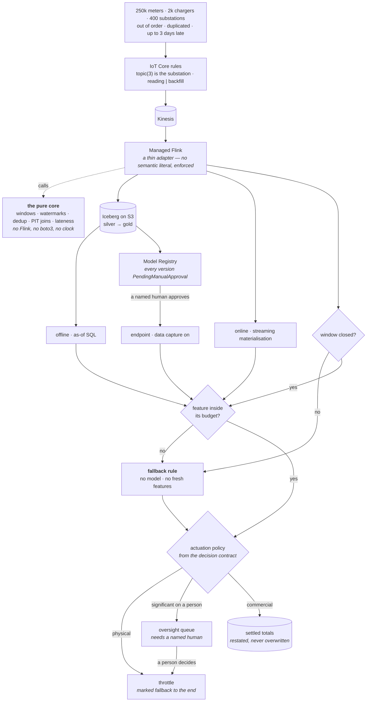
```mermaid
flowchart TB
  M["250k meters · 2k chargers · 400 substations<br/>out of order · duplicated · up to 3 days late"]
  IOT["IoT Core rules<br/>topic(3) is the substation · reading | backfill"]
  K[("Kinesis")]
  FLINK["Managed Flink<br/><i>a thin adapter — no semantic literal, enforced</i>"]
  CORE["<b>the pure core</b><br/>windows · watermarks · dedup · PIT joins · lateness<br/><i>no Flink, no boto3, no clock</i>"]
  S[("Iceberg on S3<br/>silver → gold")]
  OFF["offline · as-of SQL"]
  ON["online · streaming materialisation"]
  REG["Model Registry<br/><i>every version PendingManualApproval</i>"]
  EP["endpoint · data capture on"]
  CLOSED{"window closed?"}
  FRESH{"feature inside<br/>its budget?"}
  FB["<b>fallback rule</b><br/>no model · no fresh features"]
  ACT{"actuation policy<br/><i>from the decision contract</i>"}
  THR["throttle<br/><i>marked fallback to the end</i>"]
  Q["oversight queue<br/><i>needs a named human</i>"]
  PUB[("settled totals<br/><i>restated, never overwritten</i>")]

  M --> IOT --> K --> FLINK
  FLINK -. calls .-> CORE
  FLINK --> S --> OFF
  FLINK --> ON
  S --> REG -->|"a named human approves"| EP
  FLINK --> CLOSED
  CLOSED -->|no| FB
  CLOSED -->|yes| FRESH
  OFF & ON & EP --> FRESH
  FRESH -->|no| FB
  FRESH -->|yes| ACT
  FB --> ACT
  ACT -->|"physical"| THR
  ACT -->|"significant on a person"| Q
  ACT -->|"commercial"| PUB
  Q -->|"a person decides"| THR
```

Four things in that diagram carry the design. **The core is framework-free** — windowing,
watermarks, deduplication, point-in-time joins and every fallback rule are pure functions over
plain data, importing no Flink and no AWS SDK, which is the only reason claims 1–4 are provable on
a laptop with no cluster. **The transport decides nothing**: `check_adapter_is_thin.py` refuses a
semantic literal in the PyFlink job, so a window length cannot be baked into a Flink call. **The
two feature paths meet only at the contract** — an as-of query Athena recomputes whole, and an
incremental aggregator that saw each record once — because one shared function compared with
itself is a tautology that reports green. And **actuation is routed by the decision contract, not
by code**: a contract that declares `effect: significant_on_person` with `actuation: automatic`
fails to load, so the automatic path to a person does not exist at runtime.

---

## No decision on a window that has not closed

The claim the project is named after. Offline it is seven labelled situations; live it is a SQL
statement that any reviewer can re-run against the deployed table.

<table>
<tr>
<td width="50%">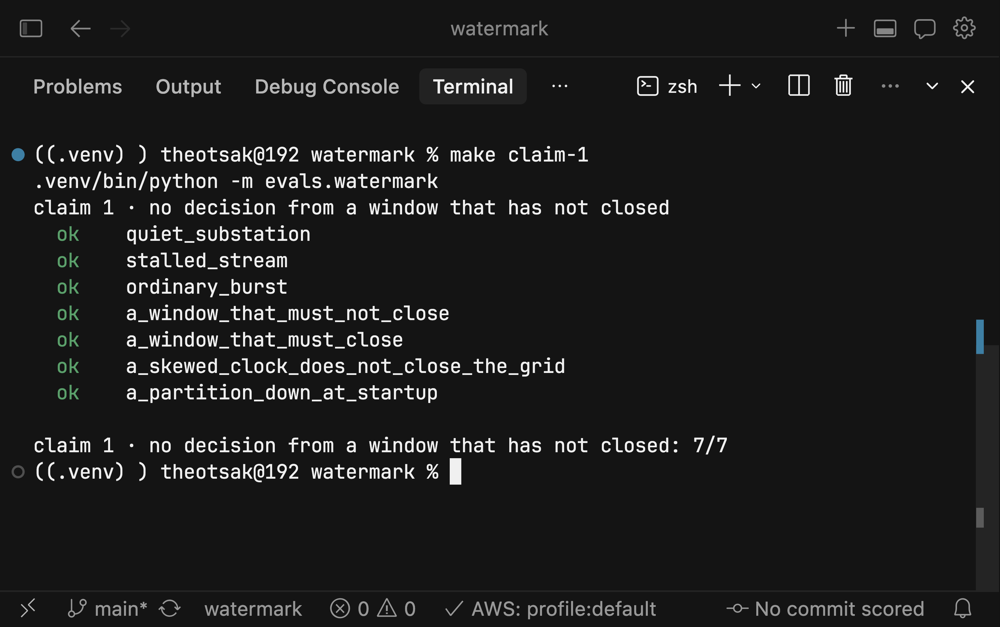<br><sub><b>7/7 offline</b> — a <code>quiet_substation</code>, a <code>stalled_stream</code>, a device whose clock is three hours fast, a partition already down at start-up, and <code>a_window_that_must_close</code>, which is there so the suite cannot pass by refusing everything.</sub></td>
<td width="50%">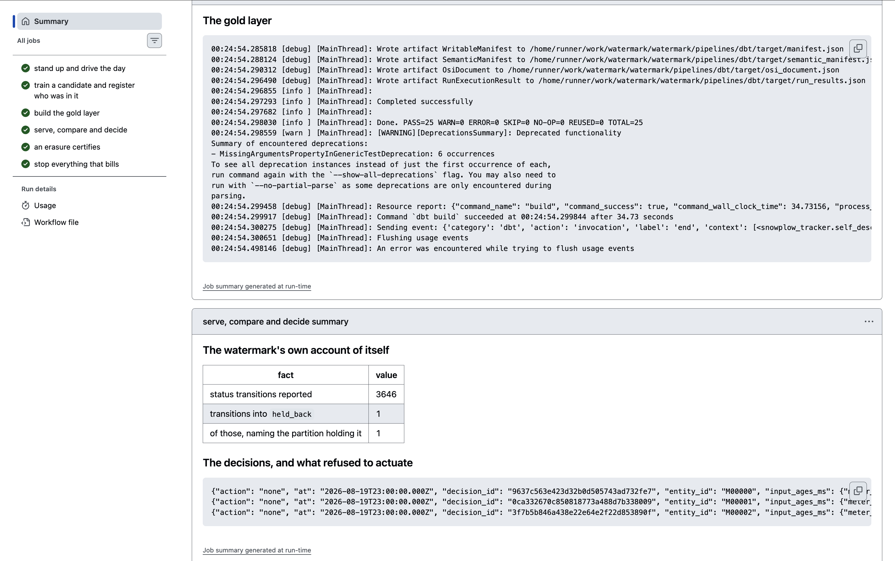<br><sub><b>And the edge case, live</b> — <b>3,646</b> status transitions reported, <b>1</b> into <code>held_back</code>, and <b>1</b> of those naming the partition holding it. A held-back watermark that cannot say <i>who</i> is holding it is the half that makes the state useless to an operator.</sub></td>
</tr>
</table>

That second image is the harder half of the claim. `held_back` means **no window closed**, so the
evidence for it is an absence — and an absence is exactly what a run that never started also
produces. The status lines are what make the two distinguishable: the job reports its watermark
condition on every transition, and the assertion is that every `held_back` it reports names the
substation causing it.

The property itself is asserted where it is deterministic: in `evals/watermark/` offline, and in
SQL against the deployed table, where **no row may be published with a watermark earlier than its
own interval end**. That is claim 1 as a statement about output rather than about timing, and it
holds on every run.

---

## The same day, delivered twice

Claim 2 is not "the pipeline is deterministic". It is that the same events — shuffled, duplicated
and delivered late — publish byte-identical values with identical lineage ids. The capture proves
it the expensive way: it drives the whole generated day, then **drives the whole thing again**,
and compares. That is why a thirty-minute capture costs an hour and three-quarters.

<table>
<tr>
<td width="50%">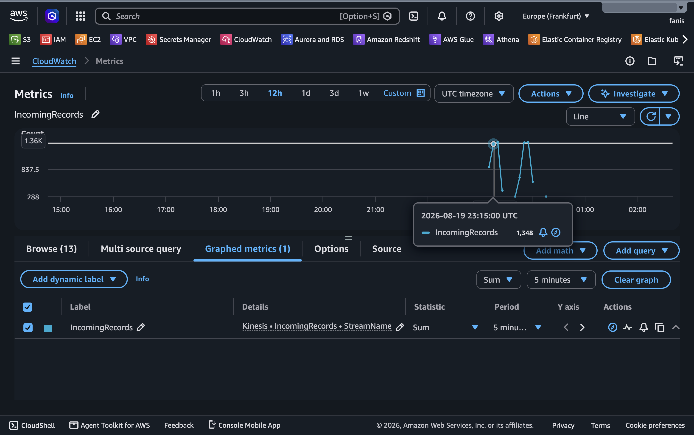<br><sub><b>Two waves, peaks 1,387 and 1,386</b> — the first is the day; the second is the same day again, re-shuffled, with duplicates and late arrivals. The gap between them is the lakehouse merge. The graph shows the <i>shape</i> is the same; the equality is asserted in the run log at <b>3,779 values identical</b>, because a chart is not a proof.</sub></td>
<td width="50%">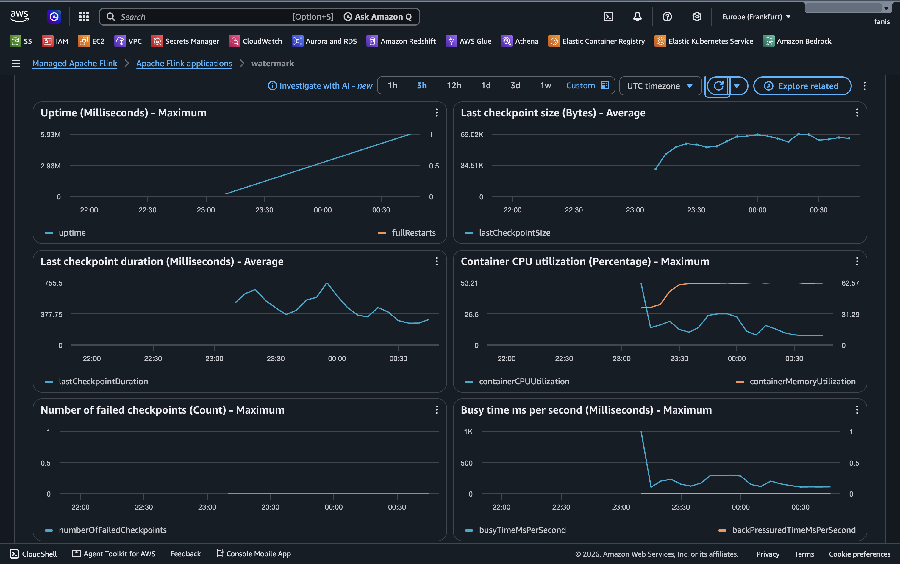<br><sub><b>And the job never restarted</b> — <code>numberOfFailedCheckpoints</code> flat at <b>0</b> and <code>backPressuredTimeMsPerSecond</code> at zero for the whole run. That is load-bearing rather than decorative: a restart replays from the last checkpoint, which would produce duplicates from a different cause and read as a replay defect. <code>uptime</code> climbs in one unbroken line and drops when <code>stop</code> switches the job off.</sub></td>
</tr>
</table>

Underneath, the transport is doing the thing that makes replay hard.

<p align="center">
  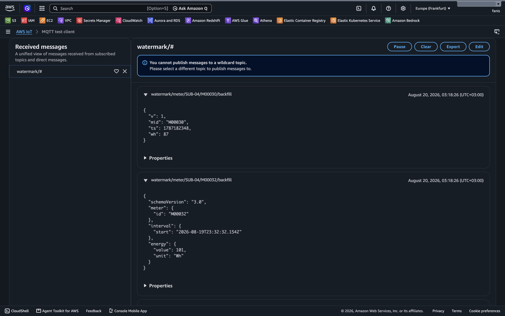<br>
  <sub><b>Late data arriving, and two schema generations in the same subscription</b> — both
  messages are on <code>/backfill</code>, which is the three-day-late head-end rather than the live
  stream, and they are different shapes: a flat <code>{v, mid, ts, wh}</code> and a nested
  <code>schemaVersion 3.0</code>. One registered union schema covers every shape a meter in this
  fleet may publish, and normalisation collapses them in the core — so lateness and schema drift
  are two problems, not one.</sub>
</p>

The topic carries the substation for a reason worth reading about. It used to be
`<project>/meter/<thing>/reading`, which made the partition key the meter id, which gave every
meter its own watermark — and a quiet substation can then never hold anything back.
[`check_partition_vocabulary.py`](scripts/check_partition_vocabulary.py) now holds the transport's
labels equal to the core's own declaration.

---

## Two mechanisms, one contract

The claim nothing else in this portfolio proves. A feature served online must equal the offline
value for the same entity at the same instant — and the two values must come from **two genuinely
different mechanisms**, sharing only the contract.

<table>
<tr>
<td width="50%">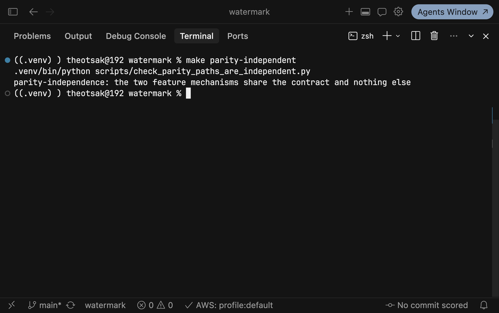<br><sub><b>The independence is checked, not asserted</b> — <code>check_parity_paths_are_independent.py</code> fails if the offline and online resolvers ever come to share an implementation. Without it, claim 3 degrades into one function compared with itself, which reports green for ever.</sub></td>
<td width="50%">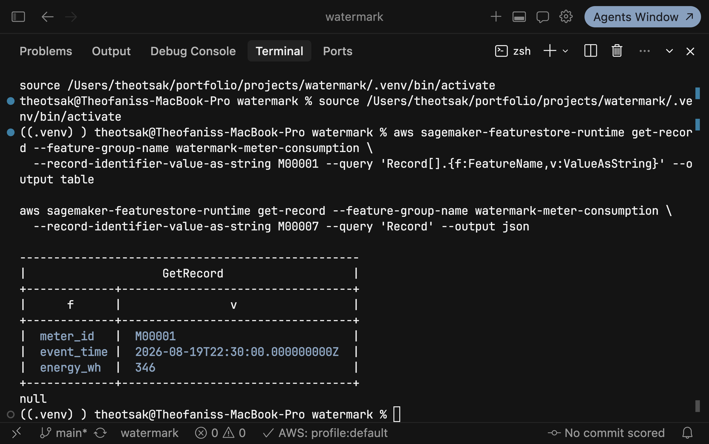<br><sub><b>The online half, live</b> — <code>M00001</code> serves <code>energy_wh 346</code> at its event time. <code>M00007</code> — the meter belonging to the erased subject — returns <b>null</b>, from the same feature group, one second apart. Claim 3 and claim 6 in one pair of commands.</sub></td>
</tr>
</table>

Live, the comparison runs over three features and twenty entities as integers, because the
contract declares a scale and [ADR-0004](docs/adr/0004-two-mechanism-parity.md) forbids a
tolerance. For most of this project's life only *one* feature was compared: the two substation
features were never served at all, because their source table was a Glue catalogue entry with no
writer — and an as-of query over an empty Iceberg table returns zero rows and no error. Claim 3
was true about a third of the feature set and read as though it covered all of it.
[`check_feature_sources.py`](scripts/check_feature_sources.py) now refuses a feature pointing at a
column no table anything writes actually has.

**Doctrine 7 lives here: one door has no key.** A parity mismatch cannot be overridden by anybody,
including the approver, because it means the number that trained the model and the number in
production are different things — so nobody knows what they would be approving.

---

## A model reaches traffic only through a person

Two claims meet in one path. The model is a two-feature XGBoost; the interesting part is
everything around it.

<table>
<tr>
<td width="50%">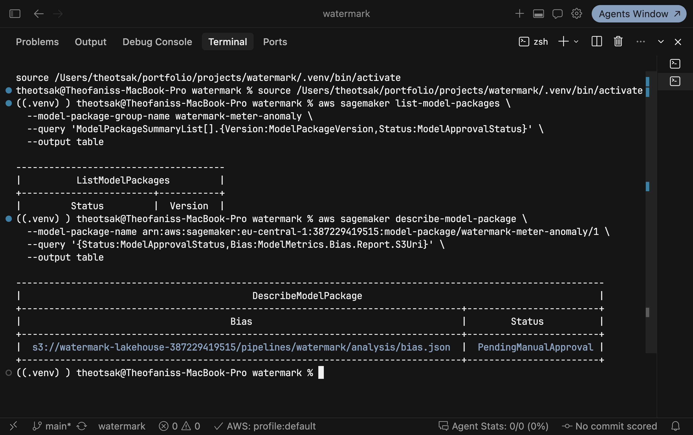<br><sub><b>Before</b> — version 1 is <code>PendingManualApproval</code>, and the bias report is attached to the registry entry rather than filed beside it. Every version is registered this way; there is no path that skips it.</sub></td>
<td width="50%">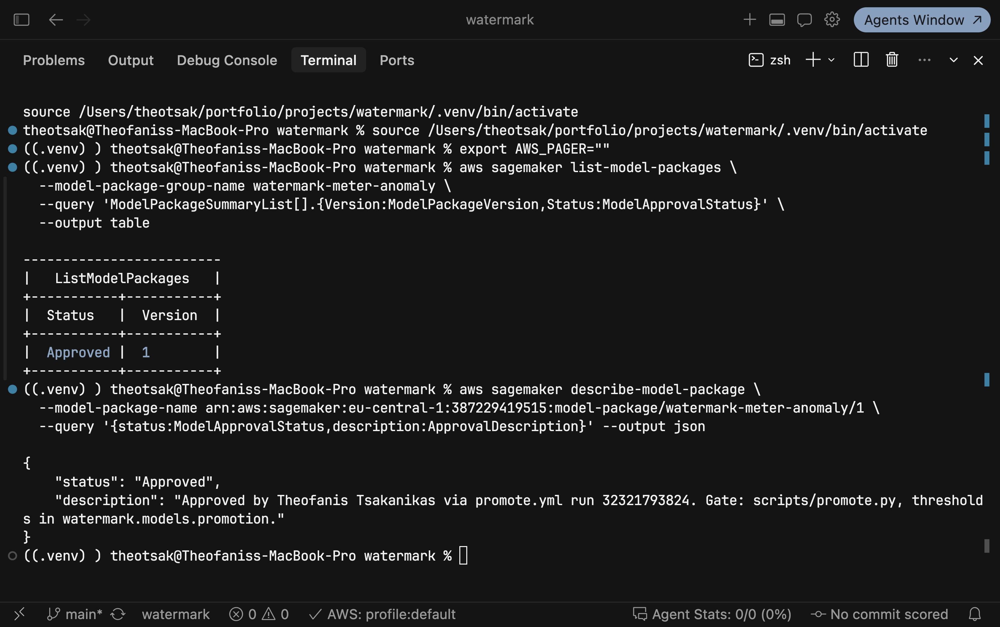<br><sub><b>After</b> — <code>Approved</code>, and the registry records <i>who</i>, <i>through which workflow</i>, and <i>against which thresholds</i>: “Approved by Theofanis Tsakanikas via promote.yml run 32321793824. Gate: scripts/promote.py.”</sub></td>
</tr>
</table>

<p align="center">
  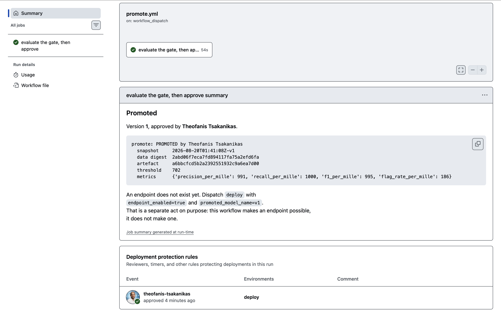<br>
  <sub><b>Fifty-four seconds, and every input to the decision is on the record</b> — the pinned
  snapshot, the digest of the rows the model was fitted on, the artefact digest, the threshold and
  the metrics. Underneath: <i>“An endpoint does not exist yet… this workflow makes an endpoint
  possible, it does not make one.”</i> And at the bottom, the deployment protection rule — a named
  human approved the <code>deploy</code> environment before any of it ran.</sub>
</p>

**The gate refuses the model this repository trained.** Not a threshold that happens to be tight —
a finding. Precision measured **1000/1000** in the most deprived tercile against **181/1000** in
the least, because 66 of 66 true cases there were confirmed by an inspector and 4 of 23 elsewhere
were. The model looks excellent exactly where the dispatch log is densest: it learned where
inspectors went, not where tampering was. The gate had been written to catch the *opposite* shape
and would have called it a pass. [BIAS-FINDING](docs/BIAS-FINDING.md) has the numbers, what
changed, and what is still not fixed.

Once a human has approved, a second deliberate deploy puts an endpoint in front of traffic — and
the endpoint's answer is recorded as it was served.

<table>
<tr>
<td width="50%">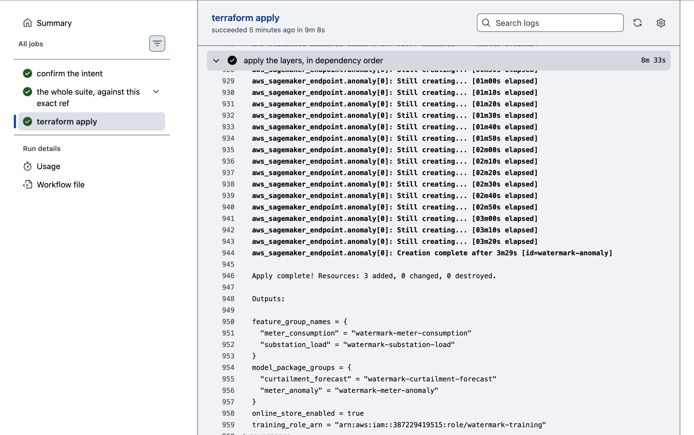<br><sub><b>The endpoint is a separate act</b> — <code>3 added</code> on the second deploy, <code>Creation complete after 3m29s</code>. On the first deploy there was no model to serve, which is claim 5 as a property of the order of operations.</sub></td>
<td width="50%">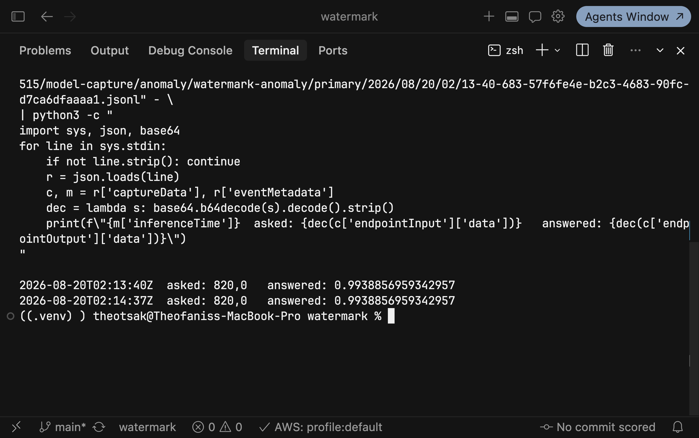<br><sub><b>The audit trail, decoded from S3</b> — <code>asked: 820,0 · answered: 0.9938…</code>, with an event id and a timestamp. AI Act Art. 12 asks for the inputs as served; a capture step that finds nothing fails the run, because an endpoint that answers and records nothing looks identical to one nobody called.</sub></td>
</tr>
</table>

That answer is the finding read out loud: asked about a meter scoring 820 in the **most deprived**
tercile, the model is 99.4% confident. A confident number is not a correct one.

Claim 7 is the other half, and both halves were exercised live: `oversight queue: 20 pending, 0
actuated`, then exactly one actuated **on the review of a named human**. The refusal is proved on
every run; what needed a live estate and a name is the positive — that a named person is the only
thing that *can* actuate.

---

## Erasure, and the leg it cannot reach

An erasure request has to reach the lakehouse, the offline store, the online store, every training
set, and the key that makes the ciphertext readable. It cannot reach the weights of a model trained
before the request, and this repository refuses to pretend otherwise.

<p align="center">
  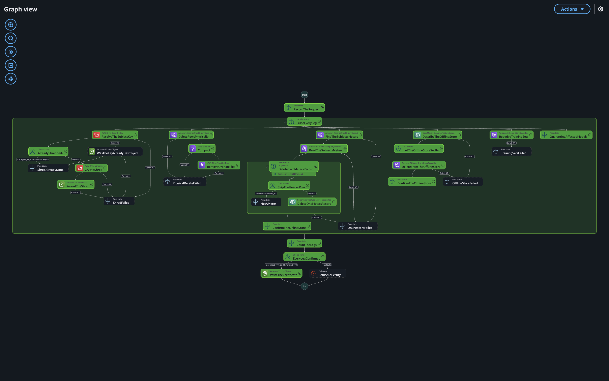<br>
  <sub><b>Six legs in parallel, and the branch that was not taken</b> —
  <code>CryptoShred</code>, <code>DeleteRowsPhysically</code>, the online-store map,
  <code>DeleteFromTheOfflineStore</code>, <code>RederiveTrainingSets</code> and
  <code>QuarantineAffectedModels</code>, converging on <code>CountTheLegs</code> →
  <code>EveryLegConfirmed</code>. Read the edge condition: <code>$.counted == 6 and $.refused ==
  false</code>. <code>RefuseToCertify</code> sits beside it in red, unentered. Note
  <code>LetTheOfflineStoreSettle</code> — a wait state, because a record already in flight landed
  46 seconds after the DELETE on an earlier run.</sub>
</p>

The condition **counts**. It used to be a five-way `AND` over array positions — and a hand-counted
condition cannot notice a missing leg, because the missing leg is what changes the count. The
`offline_store` leg was declared in the scope, had **no branch in the machine at all**, and four of
a subject's rows survived an erasure that certified.
[`check_erasure_legs.py`](scripts/check_erasure_legs.py) now holds the scope, the branches and the
count equal on every push.

<table>
<tr>
<td width="50%">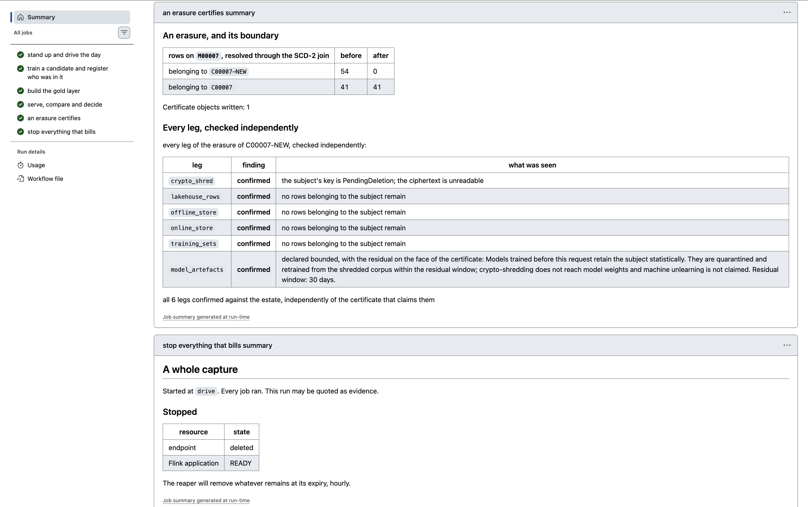<br><sub><b>Both directions, and six independent confirmations</b> — <code>M00007</code> changes customer mid-day, so the subject owns <b>54</b> rows and their predecessor <b>41</b>. After: <b>0</b> and <b>41</b>. Over-deletion is a breach in the other direction and the harder one to notice, because nobody complains about being forgotten too thoroughly.</sub></td>
<td width="50%">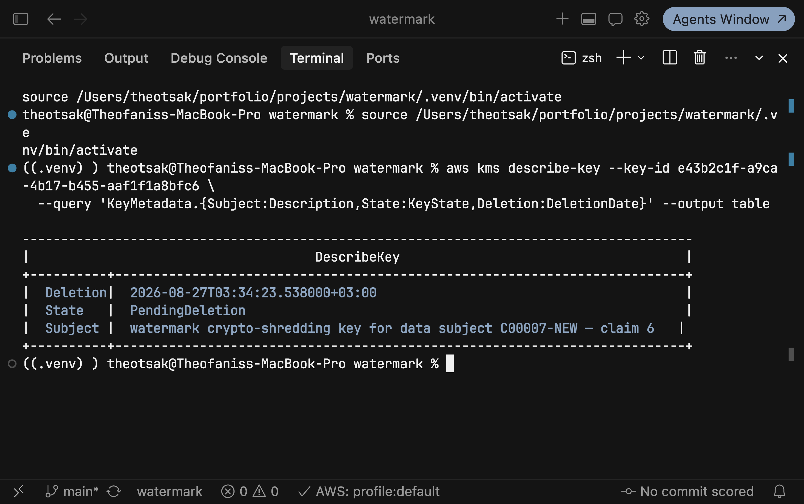<br><sub><b>One key per data subject</b> — <code>PendingDeletion</code>, seven days out, and the description names the subject. Seven days is the shortest AWS allows and deliberately shorter than the root key's thirty: GDPR Art. 12(3) puts a one-month clock on the request, and a key that lingers spends most of it in a state where the data is still readable.</sub></td>
</tr>
</table>

<p align="center">
  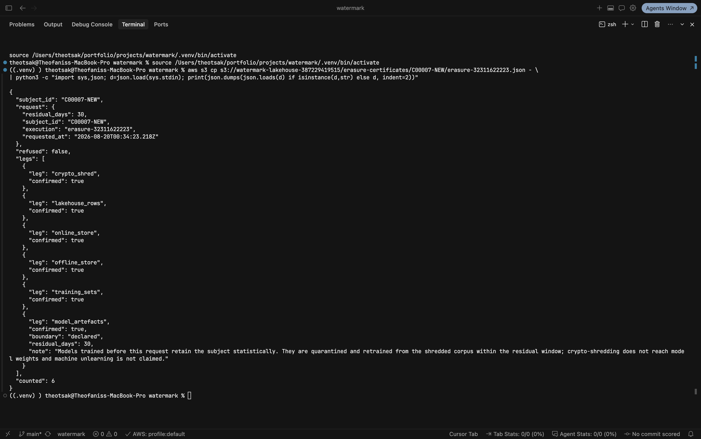<br>
  <sub><b>A certificate that states what it could not erase</b> — six legs, <code>refused: false</code>,
  <code>counted: 6</code>, and the sixth carrying <code>boundary: declared</code> with a residual
  window of 30 days: <i>“Models trained before this request retain the subject statistically. They
  are quarantined and retrained from the shredded corpus within the residual window;
  crypto-shredding does not reach model weights and <b>machine unlearning is not claimed</b>.”</i>
  The system refuses to report “erased” unless every leg confirms — and refuses to imply more than
  it did.</sub>
</p>

The certificate is not the evidence. [`erasure_legs_live.py`](scripts/erasure_legs_live.py) asks
the estate the same six questions through **different services** — the shred through KMS, the
online store through `GetRecord`, the lakehouse and the training sets through Athena — because a
certificate that verifies its own legs is a signature on a blank page.

---

## Nobody can read the lakehouse

Governance is easy to claim and hard to demonstrate, because working access looks the same whether
or not the controls exist. So here it is demonstrated the only way that proves anything: by being
refused, as the account owner.

<table>
<tr>
<td width="50%">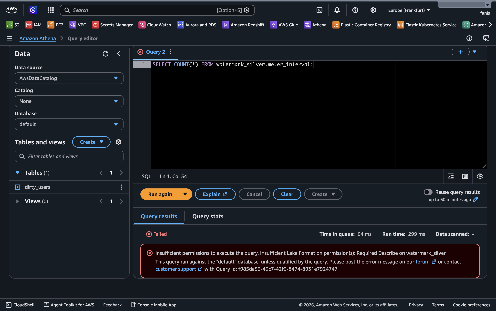<br><sub><b>The owner of the account, refused</b> — <code>Insufficient Lake Formation permission(s): Required Describe on watermark_silver</code>. The table list on the left does not contain a single <code>watermark_*</code> table either: Lake Formation filters the catalogue, so the data is not forbidden, it is <i>absent</i>.</sub></td>
<td width="50%">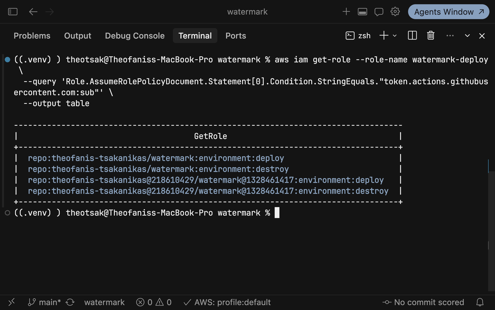<br><sub><b>And the only identity that can</b> — the deploy role trusts four subjects, all of them <code>repo:…/watermark:environment:deploy|destroy</code>, through <code>AssumeRoleWithWebIdentity</code>. No user, no laptop, no console role-switch, and no long-lived key anywhere in the repository.</sub></td>
</tr>
</table>

<p align="center">
  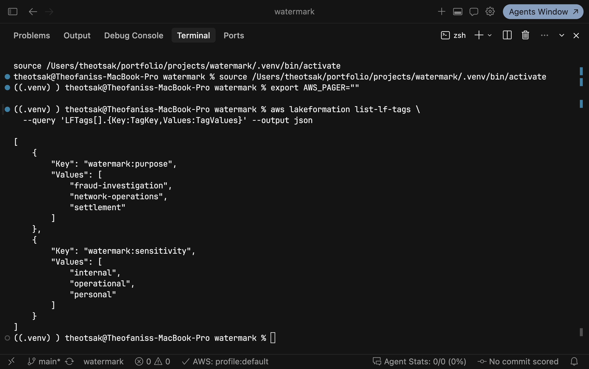<br>
  <sub><b>Two axes, six values</b> — <code>watermark:sensitivity</code> is
  <i>internal · operational · personal</i>; <code>watermark:purpose</code> is
  <i>settlement · network-operations · fraud-investigation</i>. A grant has to match on both, which
  is why a settlement principal cannot read personal columns for a fraud investigation.
  <code>make policy</code> evaluates the whole lattice offline — <b>24 principal-resource pairs</b>,
  every reachable set exact and every closed path closed — with no AWS account.</sub>
</p>

The figures this README quotes therefore come from the run log rather than from a person querying
a table, and that is the point rather than an inconvenience: the numbers were produced by a role
only CI can assume, into a log nobody edits afterwards.

---

## The gates are attacked

Every gate is broken on purpose and required to refuse — **by name, and for the right reason**. A
non-zero exit is not evidence. A mutation whose target has moved is reported `STALE`, never
`passed`.

<p align="center">
  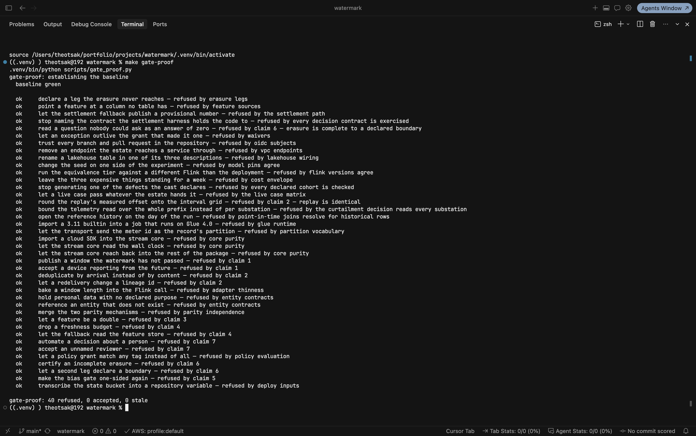<br>
  <sub><b>40 refused, 0 accepted, 0 stale</b> — read the mutation names rather than the total.
  <i>automate a decision about a person</i> is claim 7 planted as a contract change.
  <i>let a redelivery change a lineage id</i> is claim 2. <i>round the replay's measured offset onto
  the interval grid</i>, <i>bound the telemetry read over the whole prefix instead of per
  substation</i> and <i>import a 3.11 builtin into a job that runs on Glue 4.0</i> are mistakes this
  project actually made, promoted into permanent attacks after they were fixed.</sub>
</p>

Writing the mutations is also how the gaps in the harness were found: six checks had no mutation
against them at all, and eleven more under `scripts/` were never run by one. Coverage is now
mechanical — `test_every_check_script_is_run_by_a_mutation` means a new check ships red until
something attacks it.

The same thirty-second demonstration runs on a laptop with no cloud at all. Change one line in
[`contracts/decisions/meter_anomaly.yaml`](contracts/decisions/meter_anomaly.yaml) —
`actuation: human_gated` to `automatic` — and the contract set refuses to load:

```
meter_anomaly.yaml: decision 'meter_anomaly' has a significant effect on a person and declares
automatic actuation. GDPR Art. 22(1) gives a data subject the right not to be subject to a
decision based solely on automated processing that significantly affects them. This contract
does not load — the combination has no runtime representation, which is what claim 7 means by
structurally incapable.
```

---

## Quickstart

Requires Python 3.12+ and `make`. Step 1 installs from PyPI; **everything after it runs with no AWS
account, no credentials and no network.**

```bash
# 1. Install into a local virtualenv
make install

# 2. The seven claims, each with its own harness
make claim-1     # no decision from a window that has not closed
make claim-3     # train/serve parity, between two independent mechanisms
make claim-6     # erasure is complete to a declared boundary

# 3. Break every gate on purpose — each must be refused by the named gate
make gate-proof

# 4. Everything CI runs, in one command
make ci
```

`make claims` runs every claim gate that exists. Deploying is a separate, deliberate act:
`deploy.yml`, `capture.yml`, `promote.yml` and `destroy.yml` are `workflow_dispatch` only, behind
required reviewers, and are described in [`docs/DAY-ONE.md`](docs/DAY-ONE.md).

---

## Testing

**341 tests** — offline, credential-free, no JVM, in about three seconds. They cover the pure core
(windows, watermarks, deduplication, point-in-time joins, lateness, quarantine), the contract
loader, the feature registry and both resolution paths, the decision engine and its fallbacks, the
promotion gate, the erasure scope and certificate, the lineage and restatement records, the policy
evaluator, and every gate module.

They deliberately do **not** cover: the accuracy of any model, which is what `evals/` measures
against a labelled population; core↔Flink equivalence, which needs a JVM and lives in
`tests_flink/`; and live AWS behaviour, which is what `capture.yml` asserts against a deployed
estate and which therefore needs credentials.

```bash
make test        # the suite
make lint        # ruff check + format check — the exact command CI runs
make preflight   # everything that must be true before the estate is stood up
```

A second, slower tier — `make test-flink` — runs the **real PyFlink job on a local MiniCluster**
and asserts it produces byte-identical output to the pure core. It cannot execute on arm64 macOS,
because `apache-flink` requires `apache-beam`, which has no wheel there
([AWS-CONSTRAINTS](docs/AWS-CONSTRAINTS.md), dated) — so it runs in CI on Linux with
`WATERMARK_REQUIRE_FLINK=1`, which turns a missing runtime into a failure rather than a skip. A
suite that quietly skips reports green for one thing less than it says.

`make preflight` runs **37 checks** — correctness, consistency and deployability — and is what has
to pass before the estate is stood up. CI ([`.github/workflows/ci.yml`](.github/workflows/ci.yml))
runs six jobs on every push: a secret scan; lint and tests; the claim gates; the 40 gate
mutations; core↔Flink equivalence; and `terraform validate` against real provider schemas with
checkov beside it.
`deploy.yml` re-runs that entire file against the exact ref being deployed — not "CI passed on main
last night".

<p align="center">
  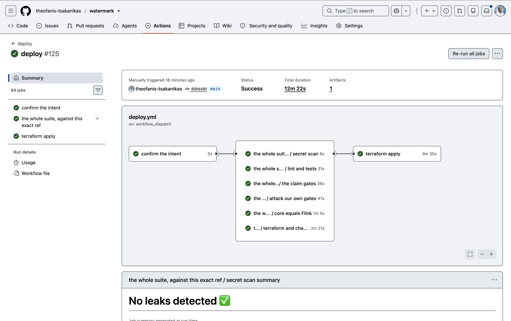<br>
  <sub><b>The gate is upstream of the apply, not beside it</b> — <code>secret scan</code> 8s,
  <code>lint and tests</code> 31s, <code>the claim gates</code> 36s,
  <code>attack our own gates</code> 47s, <code>core equals Flink</code> 1m 05s and
  <code>terraform and checkov</code> 2m 21s all complete before <code>terraform apply</code>
  starts. The commit is named at the top — <code>89fd48f</code> — so what was tested and what was
  applied are the same ref, and nothing reaches AWS until every one of them is green.</sub>
</p>

---

## Repository layout

| Path | Purpose |
|---|---|
| [`contracts/`](contracts/) | **The source of truth.** YAML: entities with SCD-2 rules, features with freshness budgets, decisions with fallback rules and actuation policy. Data, never imported by name. A feature with no freshness budget cannot load |
| [`src/watermark/core/`](src/watermark/core/) | **Pure.** Windows, watermarks, deduplication, point-in-time joins, lateness, quarantine. Standard library only, no clock, no cloud — enforced by `make core-pure` |
| [`src/watermark/features/`](src/watermark/features/) | The registry and the two resolution paths, kept independent by `make parity-independent` |
| [`src/watermark/decisions/`](src/watermark/decisions/) | The engine, the fallback rules and the oversight queue. Reached by the live capture, not only by tests |
| [`src/watermark/models/`](src/watermark/models/) | Training as of a pinned snapshot, reproducibility, the bias examination, and the promotion gate |
| [`src/watermark/erasure/`](src/watermark/erasure/) | The scope, the certificate, and the independent verifier |
| [`streaming/`](streaming/) | The PyFlink adapter. It moves records and decides nothing — no semantic literal, enforced |
| [`data/`](data/) | The synthetic operator: a fixed cast and a seeded day carrying every pathology in the scenario, on purpose and labelled |
| [`evals/`](evals/) | The claim harnesses — labelled situations, scored, credential-free |
| [`recordings/`](recordings/) | The golden day. `make seed-check` proves the generator still reproduces it exactly |
| [`queries/`](queries/) · [`pipelines/dbt/`](pipelines/dbt/) | Settlement SQL with bound parameters, and the gold models with the two tests that matter more than the models |
| [`infra/`](infra/) | Six Terraform layers, state isolated per layer. `bootstrap/` applies from a laptop; every other layer only from a gated workflow |
| [`scripts/`](scripts/) | `gate_proof.py`, `preflight.py`, and the checks that read the repository about itself |
| [`docs/`](docs/) | Scenario, regulatory posture, AWS constraints, decisions, ADRs |

---

## What this does not do

- **The savepoint-restore drill does not exist.** ADR-0003's second tier proves the PyFlink adapter
  and the pure core agree on a cold run. Equivalence *across a restart* — cancel with a savepoint,
  resume, produce the same bytes over the break — needs a harness rather than an assertion, and the
  test is skipped. It is **WV-001** in [`contracts/waivers.yaml`](contracts/waivers.yaml) with a
  name and an expiry, which is the difference between a gap somebody chose and a gap nobody noticed.
- **Model Monitor and Clarify are not deployed.** Both are closed by AWS to accounts of this class,
  so ADR-0006's "Clarify runs but does not vote" is argued from the pipeline definition rather than
  from a run. The bias analysis that would have used them is computed offline and gates the
  promotion there instead. **WV-002**, dated.
- **Claim 4 has no live proof, and the run log does not pretend it does.** The capture reports
  `20 of 20 served values were past the 15m budget` — a report about timing, because the comparison
  runs forty minutes after the drive ends, not a demonstration that a stale feature was refused.
  Freshness is proved in `evals/freshness/`, 7/7, offline.
- **`held_back` cannot be induced deterministically at capture compression.** The silent
  substation's forty minutes of event time pass in about eight seconds of wall time at 191×, so
  whether a batch boundary falls inside it is a matter of alignment. It fired on this run and did
  not on three earlier ones. The property is asserted where it is deterministic; the live
  occurrence is reported, not asserted.
- **`gold.settlement_hour` has no data-quality ruleset.** It names a table dbt builds, which does
  not exist at any point during a deploy, so the ruleset cannot be attached. Closing it means
  building the gold layer inside the capture rather than by hand.
- **The curtailment model does not exist.** `contracts/decisions/curtailment.yaml` declares
  `model: curtailment_forecast`; nothing is registered under that name, so **every** throttle in
  the live capture came from the deterministic fallback. That is the designed safe state and it is
  what the numbers show — but the model half of that decision has never been served.
- **The budget guard fired, and the ceiling was the thing that was wrong.** On 20 August the tagged
  monthly spend passed a USD 110 ceiling, the action attached a deny-all policy to the deploy role,
  and the next deploy died on `ecr:GetAuthorizationToken`. Nothing had run away: the ceiling had
  been written as though it bounded one capture while the budget it enforces is monthly. It is now
  USD 250 and the reasoning is recorded where the old figure's reasoning was.
- **One region, one account, single-tenant, no load testing.** Everything is `eu-central-1`. There
  is no concurrency testing, no continuously green integration environment, and the fleet in the
  scenario is 250,000 meters while the generated day is 40.
- **One KMS key per data subject does not scale, and the repository says so rather than finding
  out.** Forty-one subjects here; 250,000 meters would be past the account quota and an eight-figure
  annual bill for encryption alone. [ADR-0009](docs/adr/0009-a-key-per-subject-and-what-it-costs.md)
  argues the envelope design a production system needs.
- **The offline-store erasure leg is correct here for a reason that would not hold in production.**
  It waits the documented flush window, which works because nothing writes the subject once the
  decision layer has finished. In production the control is a write-block before the erasure, and
  this platform has none.

---

## Cost

**Nothing is standing.** The three expensive things — Managed Flink KPUs, the Feature Store online
store and any real-time endpoint — exist only inside a bounded capture; `capture.yml`'s stop job
runs `if: always()`, and `destroy.yml` takes the layers down in reverse and deliberately does *not*
require CI to pass, because the moment somebody most needs to tear an estate down is the moment
something is broken.

| Figure | Basis |
|---|---|
| **USD 15.83** | **Measured.** One full five-step sequence — two thirty-minute captures, a promotion, an endpoint served, and a teardown — in a day |
| **USD 115.64** | **Measured.** The whole nine-day exercise, roughly fifteen captures and twenty applies, tagged |
| **under €100** | A **design ceiling** in [`CLAUDE.md`](CLAUDE.md) for one capture with teardown, enforced against the *design* by `make cost`. A ceiling, never quotable as an outcome |

Both measurements **undercount**: a cost allocation tag takes up to 24 hours to activate, so an
estate's first hours carry no tag. Quoting either figure without that sentence is the failure mode
here.

<p align="center">
  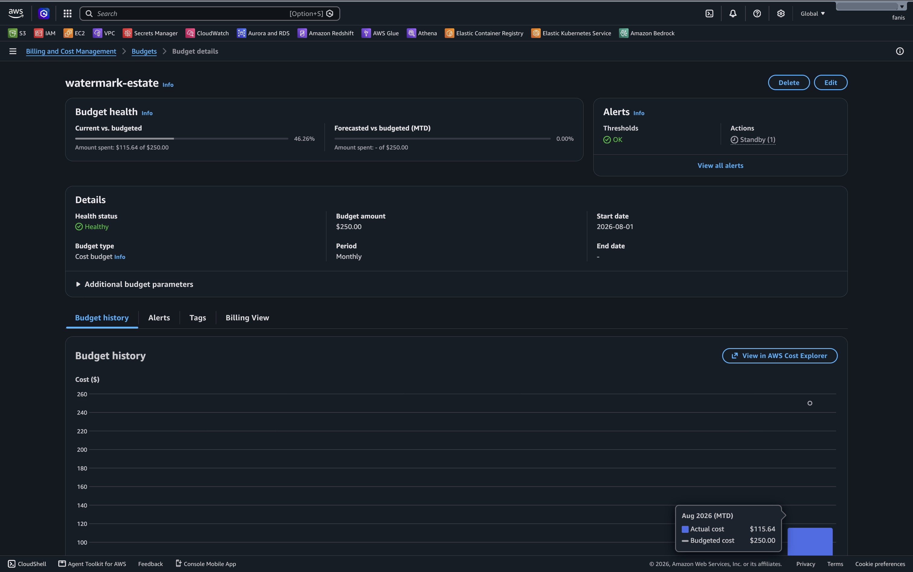<br>
  <sub><b>The ceiling is a control, not a note</b> — a monthly cost budget filtered to this
  project's tag, with an action that attaches a deny-all policy to the deploy role at 100%. It
  reads <code>Standby</code> here because it has already fired once and been reversed; the state
  above it, <code>$115.64 of $250.00</code>, is what it is watching.</sub>
</p>

Every resource carries `watermark:expires-at` and an hourly reaper enforces it — which is worth one
sentence, because for most of this project's life it was a designed control that was not even that:
it classified every expired resource, logged `would delete` and returned a list, hourly, having
deleted nothing, because the mapping from resource type to deletion API was never called. It
deletes now, behind an explicit mode, with a test over every branch that deletes and every branch
that must not.

---

## Decisions

Nine decision records in [`docs/adr/`](docs/adr/), and a running ledger in
[`docs/DECISIONS.md`](docs/DECISIONS.md) that keeps superseded entries rather than editing them —
including one decision that was wrong and is retained in full, because an argument that was wrong
is worth being able to read.

| | |
|---|---|
| [0001](docs/adr/0001-the-safe-state-is-a-conservative-action.md) | The safe state is a conservative deterministic action, not silence. On a grid, refusing to publish still overloads the transformer |
| [0003](docs/adr/0003-the-pure-core-boundary.md) | What the pure core guarantees, what the adapter may not decide, and where a JVM is genuinely needed |
| [0004](docs/adr/0004-two-mechanism-parity.md) | How claim 3 avoids being a tautology that reports green — and why no tolerance is permitted |
| [0006](docs/adr/0006-clarify-runs-but-does-not-vote.md) | Why the standard bias metric is reported and not obeyed — and why it could not run at all |
| [0007](docs/adr/0007-the-framework-carries-records-not-semantics.md) | What a live run proved PyFlink cannot do — emit a custom watermark — and why that made the design stronger |
| [0008](docs/adr/0008-the-writer-creates-the-iceberg-table.md) | Why Terraform cannot create an Iceberg table, and what owns the schema instead |
| [0009](docs/adr/0009-a-key-per-subject-and-what-it-costs.md) | One KMS key per data subject, why it is a master key rather than a data key, and the fleet-scale ceiling it has |
| **DECISIONS 15 → 17** | 15 argued the estate would never be deployed, because every claim is provable offline. 17 retracts it and names the error: proving the logic says nothing about whether the estate that would carry it can exist. 15 is kept in full |

---

## Docs

[SCENARIO](docs/SCENARIO.md) — the domain, its volumes, and the pathologies the synthetic data must
contain on purpose ·
[REGULATORY](docs/REGULATORY.md) — the legal posture, argued rather than asserted, every citation
read in source and dated ·
[BIAS-FINDING](docs/BIAS-FINDING.md) — the measurement that refuses this repository's own model ·
[AWS-CONSTRAINTS](docs/AWS-CONSTRAINTS.md) — service facts that make a design impossible rather than
merely different ·
[DECISIONS](docs/DECISIONS.md) — the running ledger ·
[DAY-ONE](docs/DAY-ONE.md) — the manual work that has no API, written down before it is done ·
[DPIA](docs/DPIA.md) · [ANNEX-IV](docs/ANNEX-IV.md) — generated from the contracts, and checked for
drift against them ·
[HANDOVER](docs/HANDOVER.md) ·
[PLAN](PLAN.md) — the four phases and what closed each · [CHANGELOG](CHANGELOG.md)

Engineering rules are in [`CLAUDE.md`](CLAUDE.md).

## Security

No long-lived access keys exist anywhere in this repository or in the account it deploys to. CI
authenticates through OIDC to a role that trusts exactly four GitHub subjects; devices authenticate
with X.509 certificates and an IoT policy that pins each one to its own topic, using
`iot:Connection.Thing.ThingName` so a device cannot publish as another; services use execution
roles; `gitleaks` gates every push. Data is encrypted with customer-managed KMS keys, one per data
subject for the shredding path, and Lake Formation grants are evaluated offline by `make policy` as
well as applied.

Scope, reporting and known limitations are in [SECURITY.md](SECURITY.md).

## License

[MIT](LICENSE) © 2026 Theofanis Tsakanikas
